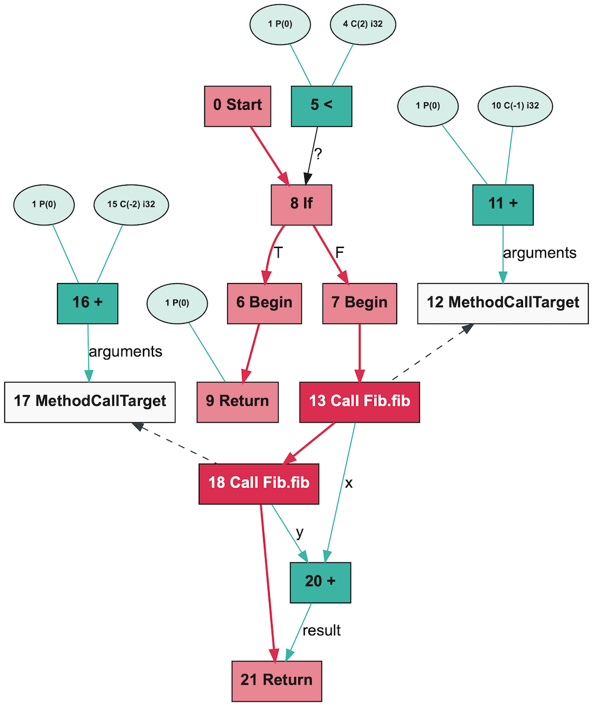
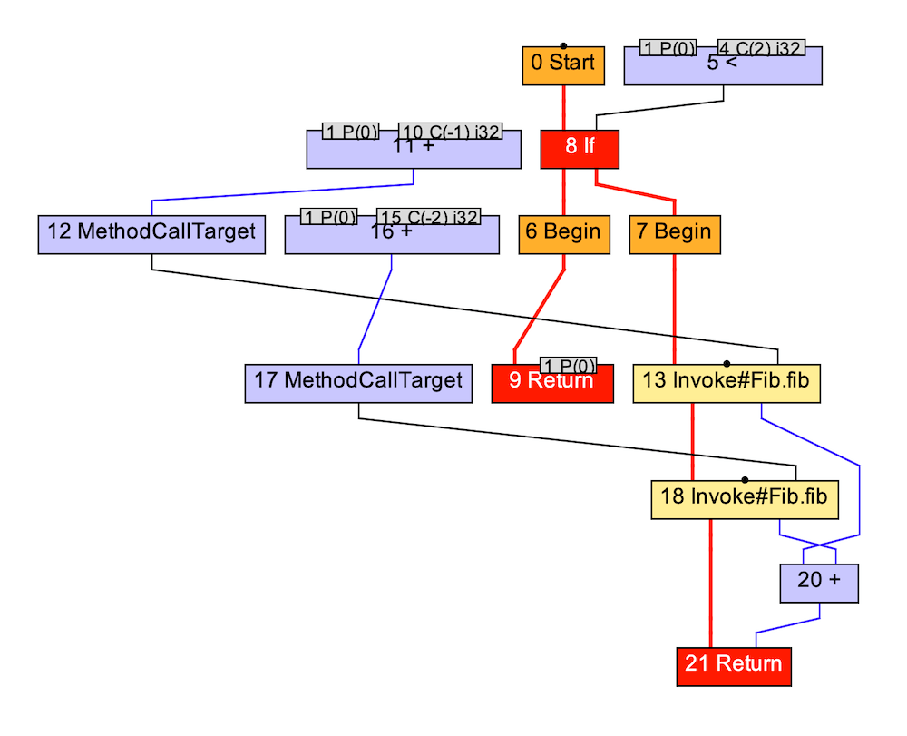
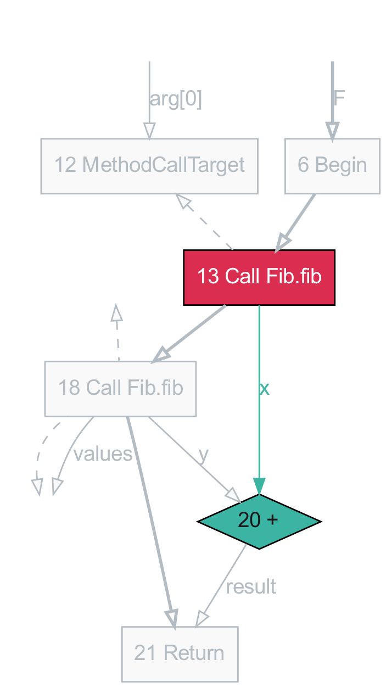
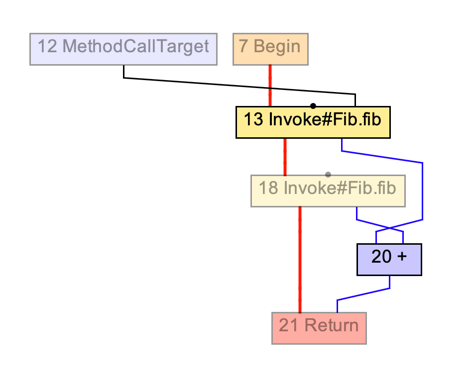

# Seafoam

*Seafoam* is a tool for working with compiler graphs. It's designed primarily
for working with the graph files dumped by the GraalVM compiler, such as in
TruffleRuby, but it could be used with other compilers and graph dump file
formats.

The *Ideal Graph Visualizer*, or *IGV*, is the tool usually used to work with
GraalVM compiler graphs. Seafoam aims to solve several problems with IGV. Unlike
IGV, Seafoam:

* is open source and can be used according to the MIT license
* supports gzip-compressed BGV files
* is able to some extent seek BGV files to load specific graphs without loading the rest of the file
* has a command-line interface
* can be used as a library
* has easy PDF, SVG and PNG output
* is designed for accessibility
* looks prettier, in our opinion

Admittedly, Seafoam does not yet have:

* an interactive user interface
* diffing of graphs
* visualization of basic blocks
* breaking of edges for very congested graphs
* the same speed in rendering big graphs - Seafoam is best suited for looking at graphs before lowering, which is what language developers are usually doing, or use spotlight

## Seafoam compared to IGV

<p>


</p>

## Installation

### macOS

```
$ brew install graphviz
$ gem install seafoam
$ seafoam --version
seafoam 0.1
```

### Ubuntu

```
$ sudo apt-get install ruby graphviz
$ gem install seafoam
$ seafoam --version
seafoam 0.1
```

#### RedHat

```
$ sudo yum install ruby graphviz
$ gem install seafoam
$ seafoam --version
seafoam 0.1
```

## Quick-start demo

```
$ seafoam examples/fib-java.bgv:0 render
```

## Getting compiler graphs

If you are just experimenting, there are example graphs such as
`examples/fib-java.bgv`.

This is just a quick summary - see more information on
[getting graphs out of compilers](docs/getting-graphs.md).

### GraalVM for Java

```
$ javac Fib.java
$ java -XX:CompileOnly=::fib -Dgraal.Dump=:2 Fib 14
```

### TruffleRuby and other Truffle languages

```
$ ruby --experimental-options --engine.CompileOnly=fib --engine.Inlining=false --engine.OSR=false --vm.Dgraal.Dump=Truffle:2 fib.rb 14
```

You will usually want to look at the *After TruffleTier* graph.

### GraalVM Native Image

```bash
$ native-image -H:Dump=:2 -H:MethodFilter=fib Fib
```

## Name syntax

When using a command-line interface, Seafoam refers to
`file.bgv[:graph][:node[-edge]]`, where `file.bgv` is a file, `graph` is a graph
index, `node` is a node index, and `to` is another node index to form an edge
from `node` to another node `edge`.

Note that a *graph ID* is an ID found in BGV files, but is not unique. A
*graph index* is what we use in names, and is unique.

## Use cases

#### Print information about a file

```
$ seafoam examples/fib-java.bgv info
BGV 6.1
```

#### List graphs in a file

```
$ seafoam examples/fib-java.bgv list
examples/fib-java.bgv:0  2:Fib.fib(int)/After phase org.graalvm.compiler.java.GraphBuilderPhase
examples/fib-java.bgv:1  2:Fib.fib(int)/After phase org.graalvm.compiler.phases.PhaseSuite
examples/fib-java.bgv:2  2:Fib.fib(int)/After phase org.graalvm.compiler.phases.common.DeadCodeEliminationPhase
examples/fib-java.bgv:3  2:Fib.fib(int)/After parsing
examples/fib-java.bgv:4  2:Fib.fib(int)/After phase org.graalvm.compiler.phases.common.CanonicalizerPhase
examples/fib-java.bgv:5  2:Fib.fib(int)/After phase org.graalvm.compiler.phases.common.inlining.InliningPhase
...
```

#### Search for strings in a graph, or node or edge within a graph

```
$ seafoam examples/fib-java.bgv:0 search Start
examples/fib-java.bgv:0:0  ...node_class":"org.graalvm.compiler.nodes.StartNode","name_template":"Start","inputs":[...
examples/fib-java.bgv:0:0  ...piler.nodes.StartNode","name_template":"Start","inputs":[{"direct":true,"name":"state...
```

#### Print edges of a graph, or node or edge within a graph

```
$ seafoam examples/fib-java.bgv:0 edges
22 nodes, 30 edges
$ seafoam examples/fib-java.bgv:0:13 edges
Input:
  13 (Call Fib.fib) <-() 6 (Begin)
  13 (Call Fib.fib) <-() 14 (@{:declaring_class=>"Fib", :method_name=>"fib", :signature=>{:args=>["I"], :ret=>"I"}, :modifiers=>9}:13)
  13 (Call Fib.fib) <-() 12 (MethodCallTarget)
Output:
  13 (Call Fib.fib) ->() 18 (Call Fib.fib)
  13 (Call Fib.fib) ->(values) 14 (@{:declaring_class=>"Fib", :method_name=>"fib", :signature=>{:args=>["I"], :ret=>"I"}, :modifiers=>9}:13)
  13 (Call Fib.fib) ->(values) 19 (@{:declaring_class=>"Fib", :method_name=>"fib", :signature=>{:args=>["I"], :ret=>"I"}, :modifiers=>9}:19)
  13 (Call Fib.fib) ->(x) 20 (+)
$ seafoam examples/fib-java.bgv:0:13-20 edges
13 (Call Fib.fib) ->(x) 20 (+)
```

#### Print properties of a file, graph, or node or edge within a graph

```
$ seafoam examples/fib-java.bgv:0 props
{
  "group": [
    {
      "name": "2:Fib.fib(int)",
      "short_name": "2:Fib.fib(int)",
      "method": null,
...
$ seafoam examples/fib-java.bgv:0:13 props
{
  "nodeSourcePosition": {
    "method": {
      "declaring_class": "Fib",
      "method_name": "fib",
      "signature": {
...
$ seafoam examples/fib-java.bgv:0:13-20 props
{
  "direct": true,
  "name": "x",
  "type": "Value"
}
```

#### Render a graph

Render a graph as a PDF image and have it opened automatically.

```
$ seafoam examples/fib-java.bgv:0 render
```

Render a graph showing just a few nodes and those surrounding them, similar to
the IGV feature of gradually revealing nodes.

```
$ seafoam examples/fib-java.bgv:0 render --spotlight 13,20
```

<p>


</p>

`render` supports these options:

* `--out filename.pdf` or `.pdf`, `.svg`, `.png`, `.dot`
* `--option key value` for custom annotators

#### Convert a file

Convert a BGV file to the Isabelle graph format.

```
$ bgv2isabelle examples/fib-java.bgv
graph0 = # 2:Fib.fib(int)/After phase org.graalvm.compiler.java.GraphBuilderPhase
 (add_node 0 StartNode [2] [8]
 (add_node 1 (ParameterNode 0) [] [2, 5, 9, 11, 14, 16]
 (add_node 2 FrameState [1] [0]
 (add_node 3 (ConstantNode 1) [] []
 (add_node 4 (ConstantNode 2) [] [5]
 (add_node 5 IntegerLessThanNode [1, 4] [8]
 (add_node 6 BeginNode [8] [13]
 (add_node 7 BeginNode [8] [9]
 (add_node 8 IfNode [0, 5] [7, 6]
...
```

## Options for GraalVM graphs

* `--show-frame-state` shows frame state nodes, which are hidden by default
* `--hide-floating` hides nodes that aren't fixed by control flow
* `--no-reduce-edges` turns off the option to reduce the number of edges by inlining simple nodes above their users

## Configuration

Seafoam loads and runs a Ruby script called `~/.seafoam/config` in the first
directory it finds starting with the current working directory and moving up.
You can require or configure extra [annotators](docs/annotators.md) in this
file.

## Debugging

Exception backtraces are printed if `$DEBUG` (`-d`) is set.

Use `seafoam file.bgv debug` to debug file parsing.

## More documentation

* [Graph annotators](docs/annotators.md)
* [Details of the BGV file format](docs/bgv.md)
* [How to get graphs from various compilers](docs/getting-graphs.md)

## Frequently asked questions

#### Why is it called *Seafoam*?

GraalVM graphs are *seas of nodes*. Seafoam is a shade of green, and Seafoam was
written at Shopify, which has green as a brand colour. Graphs can sometimes be
very complicated, appearing like a foam without any structure - Seafoam tries to
help you make sense of it all.

#### What do you mean by *graphs*, and *seas* or *soups* of nodes?

Graphs, as in edges and nodes, are the data structure some compilers use to
represent your program while they're compiling it. It's a form of *intermediate
representation*. Graphs are how the compiler understands the programs and if the
compiler isn't doing what you want you need to look at the graph and make sense
of it. Some graphs are loosely structured and large, making them like a sea or
soup of nodes.

#### Doesn't *reduce edges* actually introduce more edges?

Yes, but they're shorter edges, and it achieves the intended effect of less
edges crossing over the graph.

## Related work

The graph layout algorithm we use, via Graphviz, is

* E. R. Gansner, et al, [*A Technique for Drawing Directed Graphs*](http://citeseerx.ist.psu.edu/viewdoc/summary?doi=10.1.1.3.8982), IEEE Transactions on Software Engineering, 1993

IGV is the existing tool for working with Graal graphs. It uses a *hierarchical*
layout algorithm, rather than the *force directed* algorithm we use when we use
Graphviz. It's based on the NetBeans IDE platform. It's related to the *C1
Visualiser*, for control-flow graphs. The C1 Visualiser can also be used with
Graal as the backend of Graal is similar enough to C1. IGV is closed-source and
available under a proprietary licence.

* T. Würthinger, [*Visualization of Program Dependence Graphs*](http://www.ssw.uni-linz.ac.at/Research/Papers/Wuerthinger07Master/), Master Thesis, Linz 2007
* T. Würthinger, [*Visualization of Java Control Flow Graphs*](http://www.ssw.uni-linz.ac.at/General/Staff/TW/Wuerthinger06Bachelor.pdf), Bachelor Thesis, Linz 2006

[*Turbolizer*][turbolizer] is a similar tool for the intermediate representation
in the V8 JavaScript compiler.

[turbolizer]: https://github.com/v8/v8/blob/4b9b23521e6fd42373ebbcb20ebe03bf445494f9/tools/turbolizer

## Author

Seafoam was written by Chris Seaton at Shopify, chris.seaton@shopify.com.

## License

MIT
